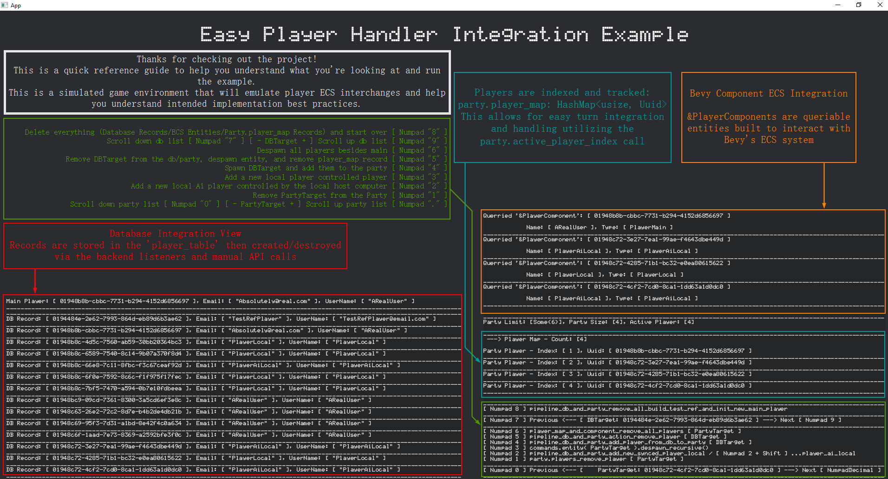

# bevy_easy_player_handler

Written initially for Bevy 0.14.2. future support planned for 0.15.

Easy Player and Party Handler system for bevy integrated with a local SQLite Database. 
This plugin includes easy to set options for the main player's Username and Email as well as flexible party Size and database interfacing for painless player record initilization and storage. 

Example: implementation_playground
```toml
[package]
name = "implementation_playground"
version = "0.1.0"
edition = "2021"

[dependencies]
bevy = { version = "0.14.2", features = ["mp3"] }
bevy_easy_player_handler = { git = "https://github.com/CodyTheDoer/bevy_easy_player_handler" }
bevy_easy_shared_definitions = { git = "https://github.com/CodyTheDoer/bevy_easy_shared_definitions" }
rusqlite = { version = "0.29.0", features = ["bundled"] }
```

A more thorough example is available in the integration_example directory.
You'll need to setup the plugin in your main function. 

```rust 
// --- main.rs --- //
use bevy::prelude::*;
use bevy_easy_player_handler::prelude::*;
use bevy_easy_shared_definitions::prelude::*;

fn main() {
    // Establish the Database Connection, this call is from ...shared_definitions
    let db = DatabaseConnection::new("game_data.db");

    // Build the main app
    let mut app: App = App::new();    
    app.add_plugins(DefaultPlugins)
        .insert_resource(db)
        .add_plugins(BevyEasyPlayerHandlerPlugin::init()
            .main_player_email("PLAYER_EMAIL")              // <--- consider a flexible data entry pipeline like dotenv
            .main_player_username("PLAYER_USERNAME")
            .party_size(6)                                  // <--- Designate your party size here, limits the spawnable players count in the game
            .build()                                        // <--- Explicitly build the plugin 
        )
        .run();
}
```

The above is the integration logic for the plugin, for an example reference ./integration_example, all of the calls were made in main.rs. I do utilize another plugin from the bevy_easy_suite for the data display. Two vecs make up the UI, for functional integration reference the temp_interface call at the bottom of the .rs file. 

The code in ```./integration_example/``` populates the following application environment.


I've also built a quick reference guide to better explain the interface and data on screen and how to manipulate it.



The implementation_playground is setup to demonstrate how the system works and how it should be called.

```
The example uses the following interface to interact with the plugin and database.
    [ Numpad 8 ] pipeline_db_and_party_remove_all_build_test_ref_and_init_new_main_player
    [ Numpad 7 ] Previous <--- [ DBTarget: {:?} ] ---> Next [ Numpad 9 ] 
    [ Numpad 6 ] player_map_and_component_remove_all_players [ PartyTarget ]
    [ Numpad 5 ] pipeline_db_and_party_action_remove_player [ DBTarget ]
    [ Numpad 4 ] pipeline_db_and_party_add_player_from_db_to_party [ DBTarget ]
    [ Numpad 3 ] commands.entity( PartyTarget ).despawn_recursive()
    [ Numpad 2 ] pipeline_db_and_party_add_new_synced_player_local / [ Numpad 2 + Shift ] ...player_ai_local
    [ Numpad 1 ] party.players_remove_player [ PartyTarget ]
    [ Numpad 0 ] Previous <--- [ PartyTarget: {:?} ] ---> Next [ NumpadDecimal ]
```

Additionally:
- The Party Target is referenced as the active player in the code, when making API calls the plugin will target the active player Component/Entities and the entry on the player_map. Listeners are setup to catch new players spawned via the Commands API and setup DB entries as well as player_map entries.

- ECS Components and the player_map will update via the Command API, db records will also be initialized automatically when new PlayerComponents spawn, but to delete the database records, those calls need to be intentionally be made.

- a Note about the DBTarget, this concept exists in the implementation playground to allow easy scrolling between all DB targets, the functionality exists in the example, not the plugin itself(Meaning if desired you would need to implement your own version of the logic).